<p align="center">
	
</p>
<h1 align="center" style="margin: 30px 0 30px; font-weight: bold;">Post</h1>
<h4 align="center">基于RuoYi-Vue  v3.8.0平台开发的博客网站</h4>
<p align="center">
<a target="_blank" href="https://www.cnposts.com/Ning-Post/">
</img>
</a>
<a target="_blank" href="https://gitee.com/Ning310975876/ruo-yi-vue-forum/blob/master/LICENSE">
</img>
</a>
</p>


## 介绍

基于**RuoYi-Vue**前后端分离基础平台开发的**博客网站**。

👍👍 感谢若依❤️❤️ 

**RuoYi-Vue** 是一个 Java EE 企业级快速开发平台，基于经典技术组合（Spring Boot、Spring Security、MyBatis、Jwt、Vue），内置模块如：部门管理、角色用户、菜单及按钮授权、数据权限、系统参数、日志管理、代码生成等。在线定时任务配置；支持集群，支持多数据源，支持分布式事务。

## 快速了解

Post是基于RuoYi-Vue平台开发  
RuoYi-Vue是一款基于SpringBoot+Vue的前后端分离极速后台开发框架。

- RuoYi 官网地址：http://ruoyi.vip(opens new window)
- RuoYi 在线文档：http://doc.ruoyi.vip/ruoyi-vue(opens new window)
- RuoYi 源码下载：https://gitee.com/y_project/RuoYi-Vue(opens new window)
- RuoYi 在线提问：https://gitee.com/y_project/RuoYi-Vue/issues(opens new window)
- RuoYi 博客：https://www.oschina.net/p/ruoyi

## 系统需求

- JDK >= 1.8
- MySQL >= 5.7
- Maven >= 3.0
- Node >= 12

## 技术选型

1、系统环境

- Java EE 8
- Servlet 3.0
- Apache Maven 3

2、主框架

- Spring Boot 2.2.x
- Spring Framework 5.2.x
- Spring Security 5.2.x

3、持久层

- Apache MyBatis 3.5.x
- Hibernate Validation 6.0.x
- Alibaba Druid 1.2.x

4、视图层

- Vue 2.6.x
- Axios 0.21.x
- Element 2.15.x

## 内置功能

1.  用户管理：用户是系统操作者，该功能主要完成系统用户配置。
2.  部门管理：配置系统组织机构（公司、部门、小组），树结构展现支持数据权限。
3.  岗位管理：配置系统用户所属担任职务。
4.  菜单管理：配置系统菜单，操作权限，按钮权限标识等。
5.  角色管理：角色菜单权限分配、设置角色按机构进行数据范围权限划分。
6.  字典管理：对系统中经常使用的一些较为固定的数据进行维护。
7.  参数管理：对系统动态配置常用参数。
8.  通知公告：系统通知公告信息发布维护。
9.  操作日志：系统正常操作日志记录和查询；系统异常信息日志记录和查询。
10. 登录日志：系统登录日志记录查询包含登录异常。
11. 在线用户：当前系统中活跃用户状态监控。
12. 定时任务：在线（添加、修改、删除)任务调度包含执行结果日志。
13. 代码生成：前后端代码的生成（java、html、xml、sql）支持CRUD下载 。
14. 系统接口：根据业务代码自动生成相关的api接口文档。
15. 服务监控：监视当前系统CPU、内存、磁盘、堆栈等相关信息。
16. 缓存监控：对系统的缓存查询，删除、清空等操作。
17. 在线构建器：拖动表单元素生成相应的HTML代码。
18. 连接池监视：监视当前系统数据库连接池状态，可进行分析SQL找出系统性能瓶颈。

## 新增功能

1.  内容管理：管理博客网站所有内容。
2.  帖子管理：管理博客帖子内容。
3.  随笔管理：管理博客随笔内容。
4.  分类管理：对博客分类的管理。
5.  标签管理：对博客标签的管理。
6.  留言管理：管理博客网站留言信息。
7.  评论管理：管理博客评论信息。
8.  文件管理：管理博客网站所有上传文件信息。

## 演示图

<table>
    <tr>
        <td>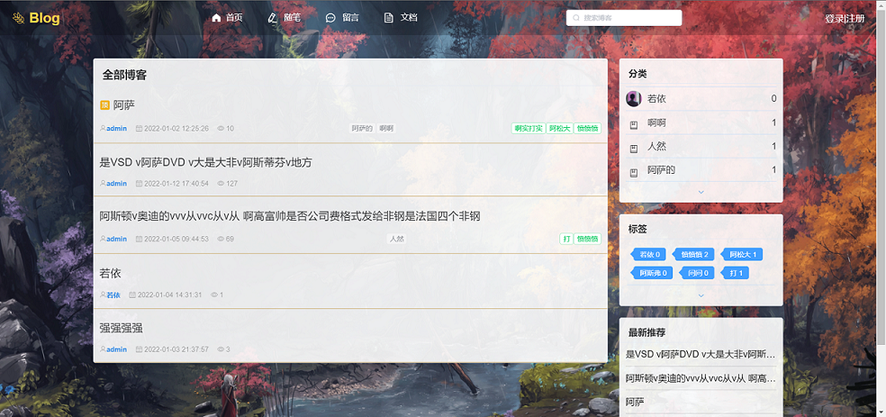</td>
        <td></td>
    </tr>
    <tr>
        <td>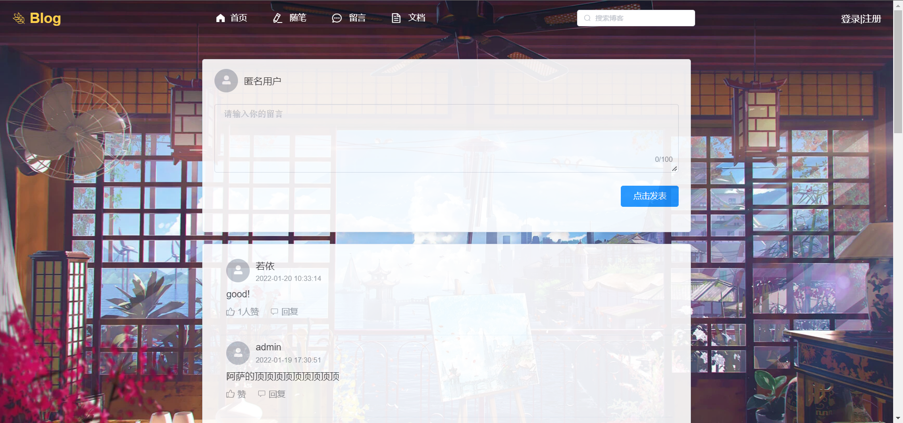</td>
        <td></td>
    </tr>
    <tr>
        <td>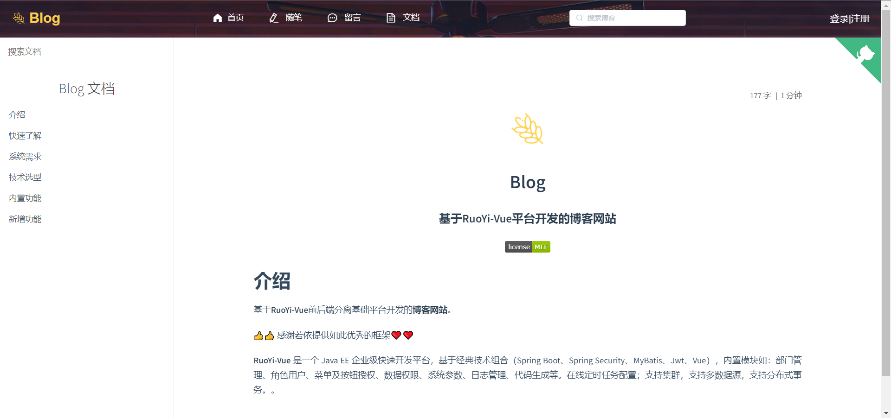</td>
        <td>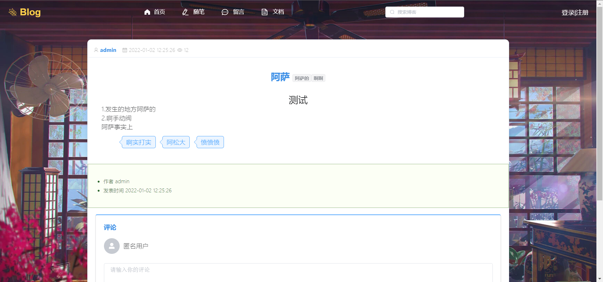</td>
    </tr>
	<tr>
        <td>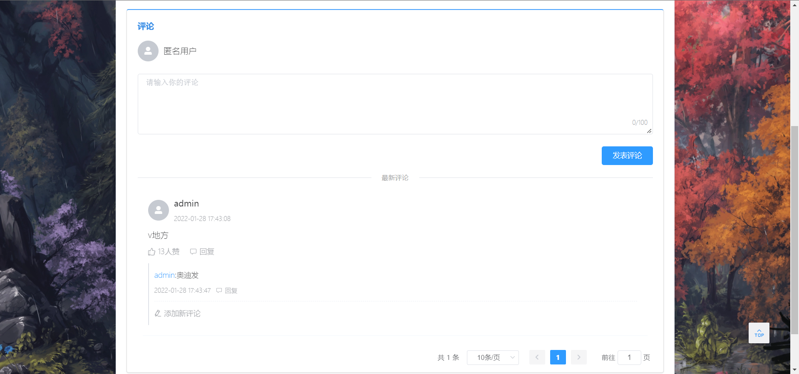</td>
        <td></td>
    </tr>	 
    <tr>
        <td></td>
        <td>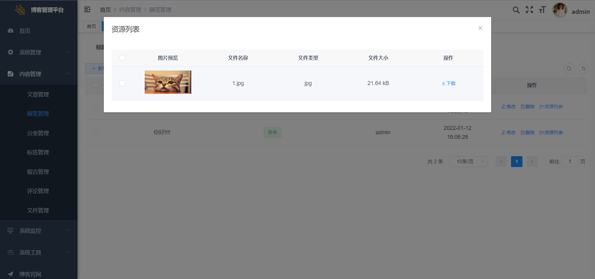</td>
    </tr>
	<tr>
        <td></td>
        <td>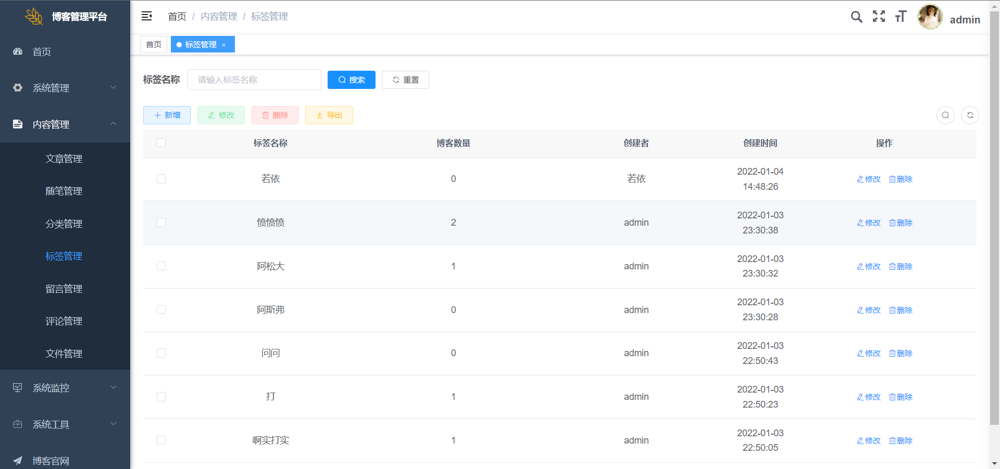</td>
    </tr>
	<tr>
        <td>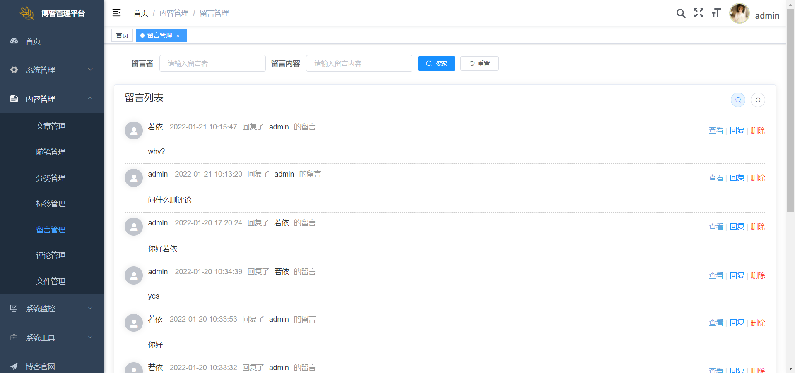</td>
        <td>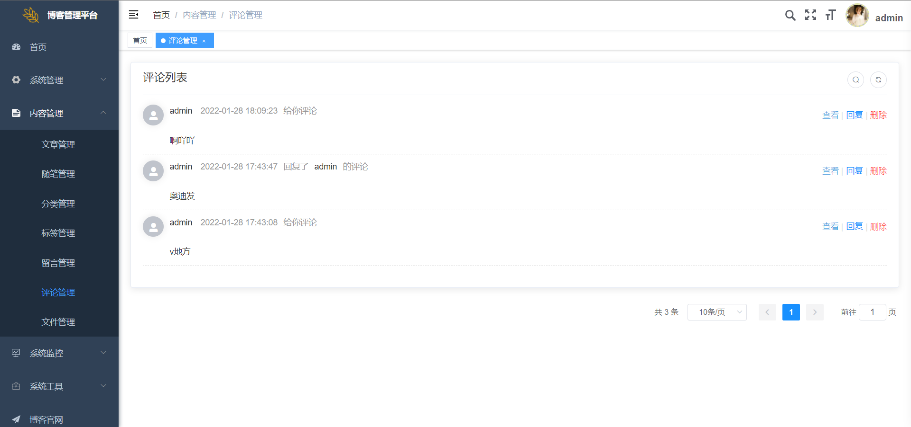</td>
    </tr>
	<tr>
        <td>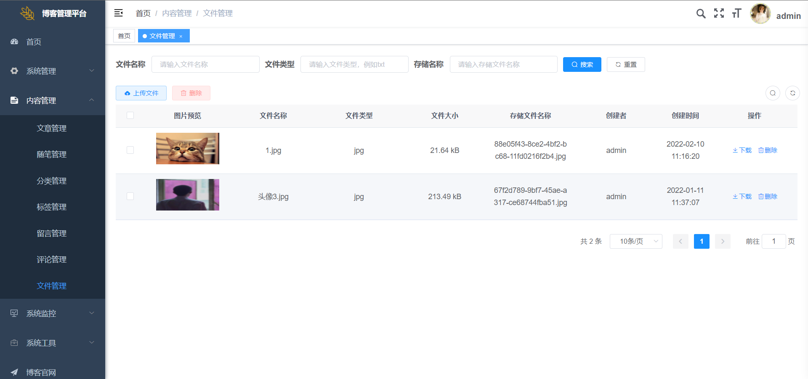</td>
        <td>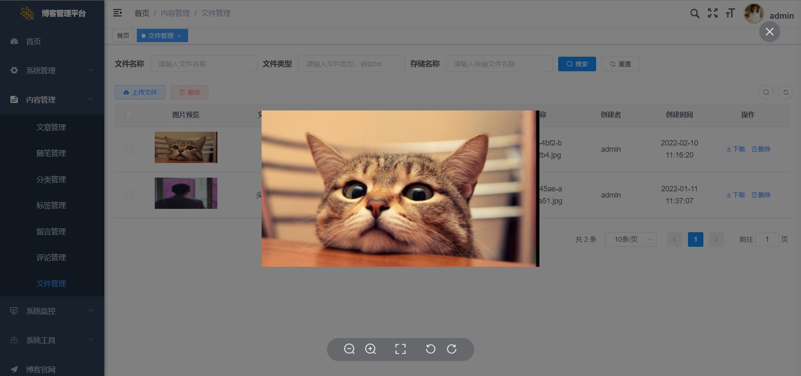</td>
    </tr>
	<tr>
        <td>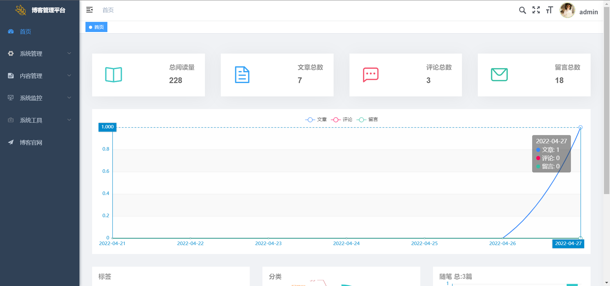</td>
        <td>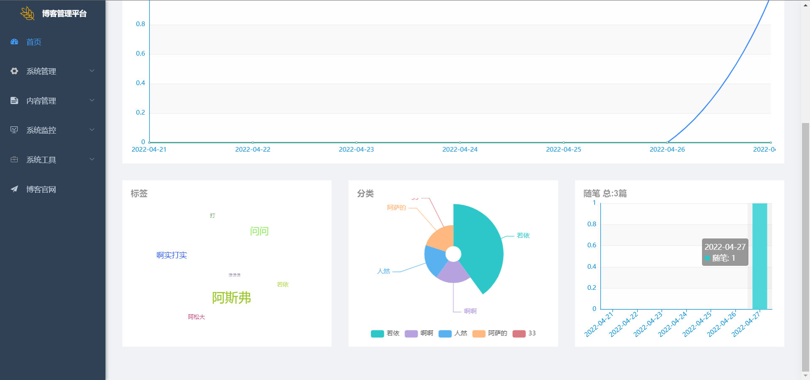</td>
    </tr>
</table>


## 开发

```bash
# 克隆项目
git https://gitee.com/Ning310975876/ruo-yi-vue-forum.git

# 进入项目目录
cd ruoyi-ui

# 安装依赖
npm install

# 建议不要直接使用 cnpm 安装依赖，会有各种诡异的 bug。可以通过如下操作解决 npm 下载速度慢的问题
npm install --registry=https://registry.npm.taobao.org

# 启动服务
npm run dev
```

浏览器访问 http://localhost:80

## 发布

```bash
# 构建测试环境
npm run build:stage

# 构建生产环境
npm run build:prod
```

